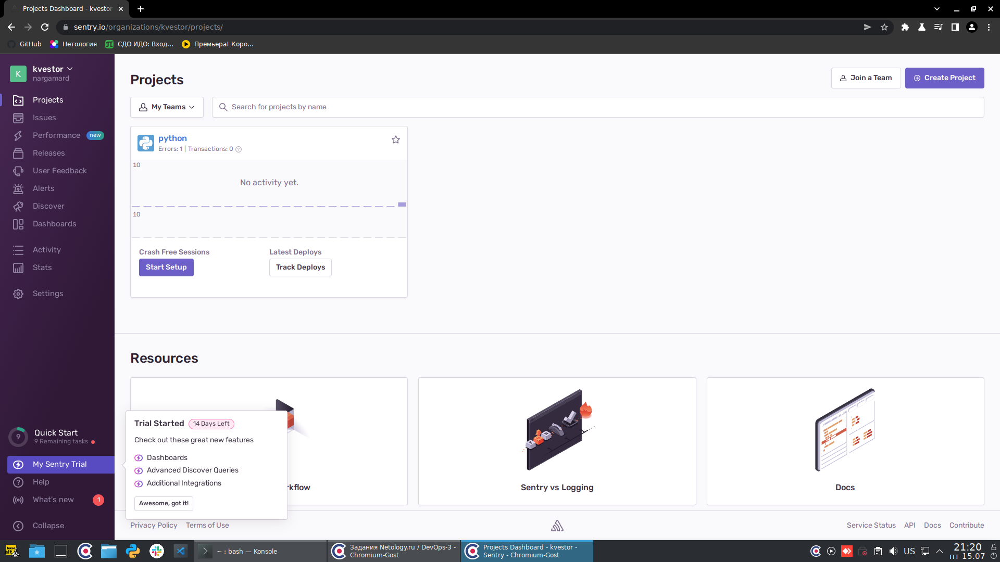
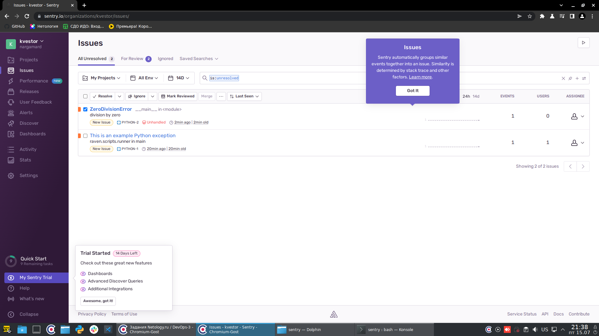
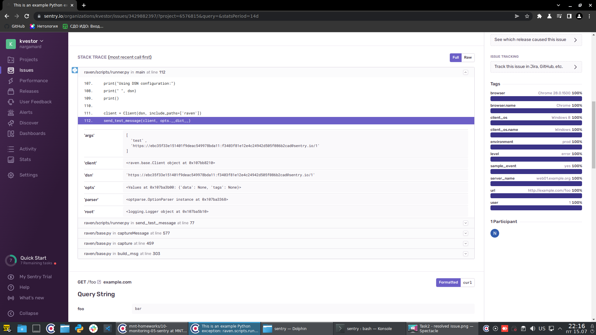
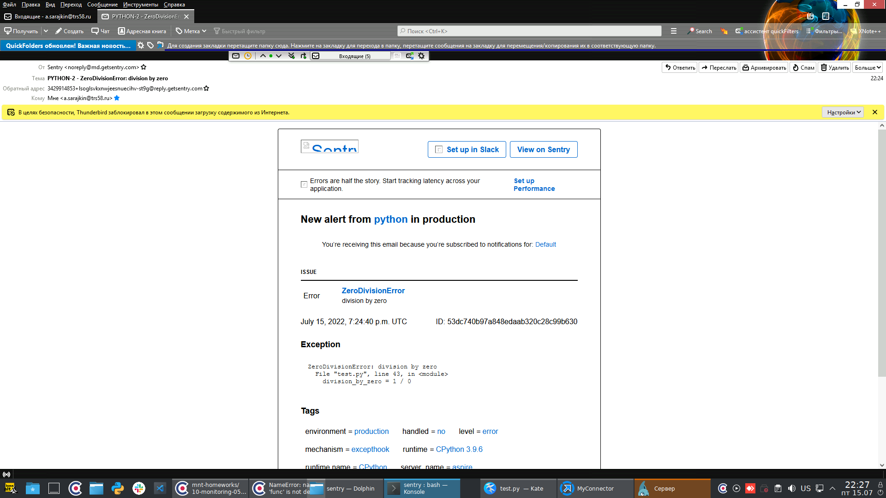

# Домашнее задание к занятию "10.05. Sentry"

## Задание 1 - подключить sentry
```
Для выполнения задания - пришлите скриншот меню Projects.
```
Ответ:


## Задание 2
```
Создайте python проект и нажмите Generate sample event для генерации тестового 
события.

Изучите информацию, представленную в событии.

Перейдите в список событий проекта, выберите созданное вами и нажмите Resolved.

Для выполнения задание предоставьте скриншот Stack trace из этого события и список 
событий проекта, после нажатия Resolved.
```

Ответ:
Нерешенные инциденты


Решенные инциденты


Stack trace


## Задание 3
```
Перейдите в создание правил алёртинга.

Выберите проект и создайте дефолтное правило алёртинга, без настройки полей.

Снова сгенерируйте событие Generate sample event.

Если всё было выполнено правильно - через некоторое время, вам на почту, привязанную 
к github аккаунту придёт оповещение о произошедшем событии.

Если сообщение не пришло - проверьте настройки аккаунта Sentry (например привязанную 
почту), что у вас не было sample issue до того как вы его сгенерировали и то, что 
правило алёртинга выставлено по дефолту (во всех полях all). Также проверьте проект 
в котором вы создаёте событие, возможно алёрт привязан к другому.

Для выполнения задания - пришлите скриншот тела сообщения из оповещения на почте.

Дополнительно поэкспериментируйте с правилами алёртинга. Выбирайте разные условия 
отправки и создавайте sample events.
```

Ответ:
